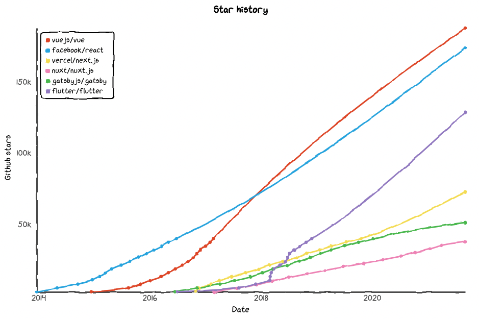

# Use Next.js as the frontend framework

## Context and Problem Statement

We need a modular frontend framework for building desktop & responsive web applications.

The current trend has move from the "old" PHP frameworks such as Symfony or Django, gradually shifting towards what we call JAMStack frameworks.

These boast added performance, resilience & developer experience.
Which JAMStack framework is best for this project ?

## Decision Drivers

- Performance
- Rendering engines (server-side vs static vs client-side)
- Developer experience

## Considered Options

- Next.js
- Nuxt.js
- Gatsby.js

[Benchmark](https://stackshare.io/stackups/gatsbyjs-vs-next-js-vs-nuxt)

## Decision Outcome

Chosen option: "Next.js", because it has a very large usebase, is based on React (also very popular, and easy to find resources) and has great traction in terms of innovation.

We should follow-up on this in the future to check how Vue.js (and Nuxt.js) evolve comparatively with React (and Next.js).

## Pros and Cons of the Options

### Next.js

Next.js offers a lot of great features, and its latest version ([Next.js 12](https://nextjs.org/blog/next-12)) seems to go in the right direction in terms of innovation in terms of performance & modularity.

Next.js is backed by Vercel, which is a [well-funded startup](https://www.crunchbase.com/organization/vercel).

They recently revamped their core build tool into Rust for performance, which means they are investing to Rust language in terms of HR.
Rust is also known to be one of the most promising language for [WebAssembly](https://webassembly.org/), a technology which may drastically change the way we approach web projects.

Main features:

- Static Site Generation (SSG)
- Incremental Static Regeneration (ISR)
- Server-Side Rendering (SSR)
- Client-Side Rendering (CSR)
- React components
- Hot reload
- [Next.js live](https://vercel.com/live) (preview)

### Nuxt.js

Nuxt.js is a Vue.js equivalent to Next.js
It was built to resemble Next.js, but has much less community, funding and features (to this day).

Choosing Nuxt over Next is irrelevant as the main debate in this case is the choice of Vue.js vs React.js

Vue has a fast-growing community (especially in France, from which it originated) but still lacks the developer base as it is a relatively new framework.

Much as Next.js is marginally known among React developers, so is Nuxt.js among Vue developers... which are currently a smaller userbase than Vue.

### Gatsby.js

Gatsby is the main alternative to Next.js, being the other popular React-based JAMStack framework.

It mainly supports SSG, in a way that is slightly better than Next.js : instead of refreshing a page every `n` seconds (arbitrary) upon page visits, Gatsby uses webhook mecanisms to detect data source changes (e.g. syncing with GraphQL or a CMS) and rebuilds the pages that changed with that data.

The main problem is that this Incremental Static Regeneration (ISR) feature is only available in Gatsby Cloud, which is a paid online service (similar to Vercel). In Next.js, ISR is for free and can be used with Vercel as well as other services (e.g. AWS Amplify).

- Good, because SSG & CSR
- Bad, because no SSR (Server-Side Rendering)
- Bad, because less popular and less funded

## Links

- Refined by [ADR-0008](0008-amplify-web-hosting.md)
