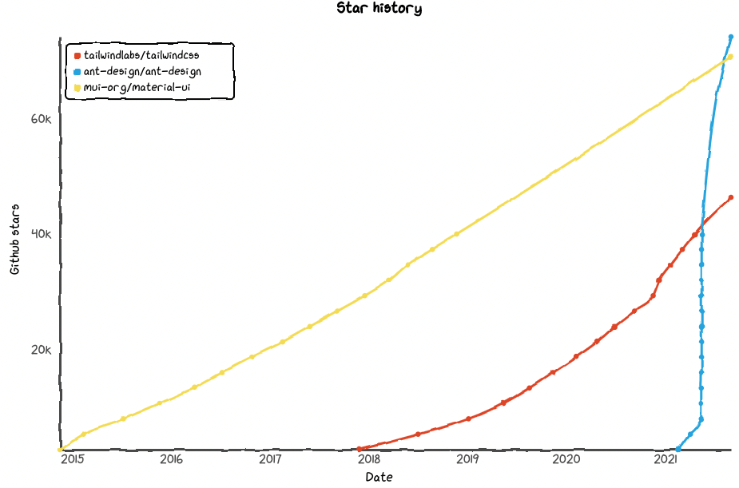

# Ant Design System

- Status: proposed
- Deciders: louis@nuage.studio
- Date: 2021-11-17

## Context and Problem Statement

In the Integrator Center, we need to provide a very functional user experience
{Describe the context and problem statement, e.g., in free form using two to three sentences. You may want to articulate the problem in form of a question.}

## Decision Drivers

- Component availability
- Designer adoption

## Considered Options

- Ant Design
- Material Design
- TailwindCSS
- Bootstrap

## Decision Outcome

Chosen option: "Ant Design", because {justification. e.g., only option, which meets k.o. criterion decision driver | which resolves force {force} | … | comes out best (see below)}.

### Positive Consequences

- {e.g., improvement of quality attribute satisfaction, follow-up decisions required, …}
- …

### Negative Consequences

- {e.g., compromising quality attribute, follow-up decisions required, …}
- …

## Pros and Cons of the Options

### {option 1}

{example | description | pointer to more information | …}

- Good, because {argument a}
- Good, because {argument b}
- Bad, because {argument c}

### {option 2}

{example | description | pointer to more information | …} <!-- optional -->

- Good, because {argument a}
- Good, because {argument b}
- Bad, because {argument c}
- … <!-- numbers of pros and cons can vary -->

### {option 3}

{example | description | pointer to more information | …} <!-- optional -->

- Good, because {argument a}
- Good, because {argument b}
- Bad, because {argument c}
- … <!-- numbers of pros and cons can vary -->

## Links <!-- optional -->

- Influenced by [ADR-0002](0002-nextjs-frontend-framework.md)
